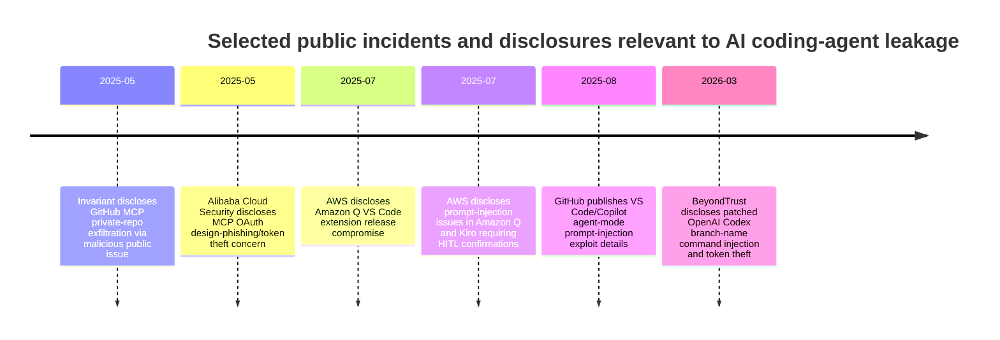
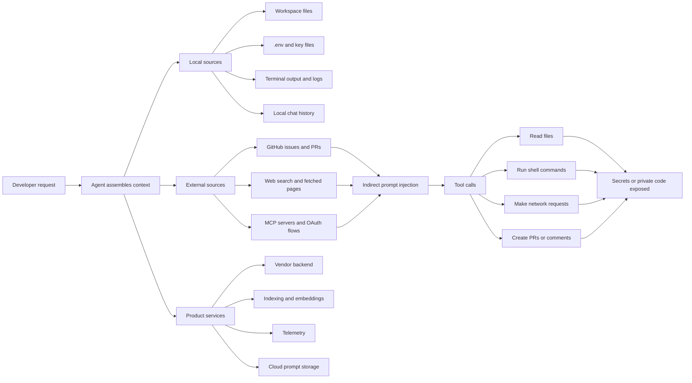

# Deep Research Report on the Pasted Text

## Executive summary

The pasted text is best read as a **product and threat-research brief** rather than as a self-contained argument. Its central premise is **substantively correct**: modern AI coding tools can expose sensitive information through several distinct paths, including direct prompt submission, background indexing/embedding, telemetry, local plaintext histories, cloud prompt storage, shell/tool execution, and indirect prompt injection through repositories, issues, pull requests, websites, or MCP servers. That is no longer a speculative concern. Official disclosures and vendor-authored security writeups now document real or patched cases across Amazon Q, GitHub Copilot and VS Code agent mode, OpenAI Codex, and MCP-based ecosystems. citeturn29view1turn29view3turn31view0turn29view4turn29view0turn28view1

The strongest verified evidence in this review comes from **official vendor sources**. AWS disclosed that malicious code was inserted into an Amazon Q VS Code extension release because of an overly broad GitHub token in the build pipeline, and AWS separately disclosed prompt-injection issues in Amazon Q and Kiro that led them to require human confirmation for commands such as `find`, `grep`, `echo`, `ping`, and `dig`. GitHub documented prompt-injection exploits in VS Code/Copilot agent mode that could have leaked local GitHub tokens, exposed confidential files, or enabled arbitrary code execution without user confirmation, and GitHub’s own Copilot cloud-agent documentation explicitly treats hidden-message prompt injection and data exfiltration as live design risks that need firewalls, scoped permissions, secret scanning, and review gates. citeturn29view1turn29view3turn31view0turn24view0turn24view1

The pasted text is also correct that the problem is broader than “users pasted an API key into chat.” Local transcripts may be stored in plaintext; indexing systems may upload chunks for embedding; prompts may traverse vendor backends even when users bring their own API key; enterprises may optionally back up prompt histories to cloud object storage; and open-source tools may persist secrets in local history files after reading `.env` or similar files. Anthropic, Cursor, Cline, and Aider all publish or expose behavior relevant to those paths, while OpenHands and Continue have public issues that point to similar operational concerns. citeturn26view1turn23view0turn23view1turn22view0turn21view1turn19view0turn18view0turn16view0turn17view0turn17view1

The main conclusion is that **a product in this space should exist**, but the pasted text slightly understates the implementation challenge. A **simple VS Code extension that only scans typed prompts** would not be enough. The evidence supports building a broader **policy-and-DLP control plane for agentic coding**: context inspection, secret and sensitive-data classification, file/path policy, tool-call approval rules, MCP allowlisting and scope control, network egress controls, and redacted logging. A VS Code extension can be one delivery surface, but it should be paired with a **local broker/proxy and enterprise policy layer** if the goal is meaningful risk reduction across multiple tools. citeturn25view0turn25view1turn26view0turn26view3turn28view0turn28view2

## What the pasted text is asserting

The pasted text makes six high-level assertions about the market and threat landscape. Five are supported or mostly supported by evidence. One is too strong if interpreted literally.

### Claims versus evidence

| Claim from the pasted text | Assessment | Evidence |
|---|---|---|
| AI coding tools can leak sensitive files, credentials, and proprietary code. | **Strongly supported.** | AWS disclosed a supply-chain compromise in Amazon Q’s VS Code extension release and separate prompt-injection command paths in Amazon Q and Kiro; GitHub documented Copilot/VS Code agent-mode exploits involving token theft, file access, and code execution; BeyondTrust disclosed a patched Codex token-theft chain; Invariant demonstrated private-repo exfiltration through GitHub MCP. citeturn29view1turn29view3turn31view0turn29view4turn29view0 |
| The main risk is no longer just prompt text; it also includes tooling, connectors, and background product behavior. | **Strongly supported.** | Cursor routes requests through its backend and may upload code chunks for embeddings; Claude Code stores local transcripts in plaintext by default for session resumption; Cline can upload conversation history to S3 or R2; GitHub Copilot cloud agent uses ephemeral environments, external integrations, and firewall controls because the agent has access to sensitive code and can take actions. citeturn23view0turn23view1turn26view1turn22view0turn24view1 |
| MCP significantly enlarges the attack surface. | **Strongly supported.** | Anthropic warns users to trust each MCP server before connecting because servers can expose users to prompt injection; Unit 42 documented resource theft, conversation hijacking, and covert tool invocation via MCP sampling; MCP’s own security best-practices and authorization materials emphasize least privilege and token scoping; Alibaba Cloud Security disclosed a phishing/token-theft design concern in MCP OAuth flows. citeturn26view2turn28view3turn28view0turn28view2turn28view1 |
| Existing vendor controls are uneven and inconsistent across products. | **Supported.** | GitHub, OpenAI, Anthropic, Cursor, and AWS all implement different combinations of approval prompts, sandboxes, privacy modes, firewalls, and secret scanning; their defaults and storage behaviors differ materially. citeturn24view0turn24view1turn25view0turn25view1turn26view0turn26view1turn23view0turn29view3 |
| A wrapper or policy layer can materially reduce accidental and medium-sophistication leaks. | **Supported as a practical inference, not directly proven by one source.** | The preventive controls that vendors themselves keep adding—HITL confirmations, network restrictions, MCP trust dialogs, hooks, secret scanning, and least-privilege scopes—are exactly the kinds of controls a wrapper/policy layer would centralize. citeturn29view3turn31view0turn25view0turn26view0turn26view3turn28view0 |
| A wrapper extension can fully prevent harmful exfiltration across tools. | **Not supported.** | Cloud agents, proprietary extensions, local plaintext histories, unsafe approvals by users, and off-path channels such as OAuth/MCP token theft or build-pipeline compromise all create routes that a prompt-only extension cannot fully govern. citeturn29view1turn28view1turn22view0turn26view1turn29view4 |

The text also assumes that “sensitive data” should include far more than classic secrets. The public evidence supports that broader definition. GitHub’s own agent docs talk about API keys and tokens; Invariant’s GitHub MCP demonstration shows exfiltration of private business information like salary and relocation plans; AWS’s prompt-injection issues included metadata exfiltration via DNS; and Cursor’s indexing disclosures show that even filenames, hashes, and embeddings can become relevant metadata exposure surfaces. citeturn24view0turn29view0turn29view3turn23view0

## Verified evidence from incidents and literature

The public record now contains enough high-confidence examples to conclude that the pasted text’s core threat model is real.

### Representative incidents and exposure pathways

| Incident or pathway | What is verified | Why it matters for the pasted text | Confidence |
|---|---|---|---|
| **Amazon Q VS Code extension compromise** | AWS says an inappropriately scoped GitHub token in CodeBuild allowed a threat actor to commit malicious code that was automatically included in Amazon Q Developer for VS Code version 1.84.0; AWS revoked credentials and released 1.85.0. AWS also states the code did not successfully execute because of a syntax error. citeturn29view1turn29view2 | Confirms that AI coding tools create **software-supply-chain** risk, not just prompt risk. A wrapper product focused only on outbound prompts would miss this class entirely. | **High** |
| **Amazon Q and Kiro indirect prompt injection** | AWS says older versions could execute `find`, `grep`, `echo`, `ping`, or `dig` in ways that enabled prompt injection, invisible prompt injection, remote code execution, or metadata exfiltration without HITL confirmation; AWS’s mitigation was to require HITL confirmation for those commands. citeturn29view3 | Strong evidence that **tool-call governance** matters as much as content filtering. | **High** |
| **VS Code / GitHub Copilot agent-mode exploits** | GitHub’s security blog says poisoned chat context could have exposed GitHub tokens, confidential files, or enabled arbitrary code execution without explicit consent; the post explains how external issue/PR content and available tools enter the prompt loop. citeturn31view0 | Direct confirmation that **indirect prompt injection against IDE agents is real** and that file reads, shell commands, and tool definitions drive the risk. | **High** |
| **GitHub Copilot cloud-agent hidden-message risk** | GitHub’s docs explicitly state that hidden messages in issues or comments can be prompt injection and that the cloud agent has access to sensitive information that could leak; GitHub mitigates with filtering, scoped permissions, human review, restricted internet access, secret scanning, CodeQL, and dependency checks. citeturn24view0turn24view1 | Confirms that even first-party cloud agents are designed under a **data-exfiltration threat model**. | **High** |
| **OpenAI Codex branch-name token theft** | BeyondTrust says a command-injection flaw in Codex let attackers inject shell commands via GitHub branch names, exfiltrate GitHub user tokens, and affect Codex web, CLI, SDK, and IDE extension flows; the disclosure includes a remediation timeline. OpenAI’s own docs independently confirm that Codex has filesystem, shell, network, and auth surfaces that require approvals, sandboxing, and careful credential handling. citeturn29view4turn30view0turn30view1turn30view2turn25view0turn25view1turn25view2 | Shows that **untrusted external metadata** like branch names can become command payloads inside coding-agent infrastructure. | **Medium-high** |
| **GitHub MCP private-repo exfiltration** | Invariant demonstrated that a malicious issue in a public repo can coerce an agent using the official GitHub MCP server into pulling private-repo data into context and leaking it through an autonomously created public PR. citeturn29view0 | This is almost exactly the kind of **cross-context leakage** the pasted text is concerned about. | **Medium-high** |
| **MCP OAuth/phishing design concern** | Alibaba Cloud Security disclosed an MCP protocol design concern that could enable token theft through malicious remote servers and argued that many clients could be vulnerable to low-cost phishing-style attacks. citeturn28view1turn28view2 | Supports the text’s concern that **connectors and protocol design** matter, not only prompt redaction. | **Medium-high** |
| **Local transcript and prompt storage exposure** | Claude Code says local clients store transcripts in plaintext under `~/.claude/projects/` for 30 days by default; Cline’s prompt storage docs say conversation history, including tool inputs and outputs, can be uploaded to S3 or R2 and may include file contents and command outputs. citeturn26view1turn22view0 | Confirms that leakage can occur through **local artifacts and enterprise backups**, even without a malicious external attacker. | **High** |
| **Aider/OpenHands secret-handling issues** | Aider has a public issue showing `.env` can be sent to model context and persisted in plaintext chat history when added with `--read`; OpenHands has a public issue claiming the agent read `.env` contents while debugging. citeturn19view0turn18view0 | Useful evidence for **open-source agent ergonomics** and accidental exposure, though weaker than vendor advisories because these are issue reports, not confirmed CVEs. | **Medium** |

The broader academic literature is consistent with those incidents. Earlier work showed that **indirect prompt injection** can compromise LLM-integrated applications and blur the line between data and instructions, while later USENIX work and emerging agentic-coding-specific studies suggest that the problem is not confined to demos and is becoming observable in real deployments. Defensive research is active, but the literature still treats this as a partially unsolved systems problem rather than a closed class of bugs. citeturn12search3turn12search0turn12search20turn10search2

## Threat model and data-flow analysis

The pasted text’s most important implicit assumption is that “sending data to the model” is the main boundary. The evidence suggests a larger and more accurate model: there are **multiple ingress paths**, **multiple storage layers**, and **multiple exfiltration channels**.

Official product documentation supports each major box in that diagram. GitHub says Copilot cloud agent combines prompts with repository context, runs in an ephemeral environment, and can interact with external tools while being protected by a firewall and scoped credentials. OpenAI documents sandbox modes, approval policies, environment-variable forwarding controls, network controls, and plaintext auth caching if file-based credentials are selected. Anthropic documents local plaintext session transcripts and warns that untrusted MCP servers can expose users to prompt injection. Cursor documents backend routing, indexing uploads, temporary server-side caching, and privacy-mode differences. Cline documents both local-first telemetry and optional cloud prompt backups. citeturn24view1turn25view0turn25view1turn25view2turn26view1turn26view2turn23view0turn21view1turn22view0

### Sensitive data classes that matter most

| Data class | Why it matters | Evidence that this class is in scope |
|---|---|---|
| **Credentials and secrets** | API keys, tokens, passwords, SSH material, and `.env` values can enable immediate compromise or lateral movement. | GitHub secret scanning is a built-in mitigation for Copilot cloud agent; AWS specifically treated metadata exfiltration and command execution as significant enough to add HITL gates; Aider and OpenHands public reports center on `.env` and secret material. citeturn24view0turn24view1turn29view3turn19view0turn18view0 |
| **Private source code and design logic** | This is the primary enterprise IP exposure risk. | GitHub, AWS, and BeyondTrust all frame exfiltration of private repository content as a core danger; Cursor and Copilot docs make clear that repository context is routinely processed during operation. citeturn24view1turn29view1turn29view4turn23view0turn31view0 |
| **Sensitive business data inside repos or connected systems** | Not all high-risk data looks like a secret; business context can still be damaging if exposed. | Invariant’s GitHub MCP demo exfiltrated salary and other private business details; Anthropic’s MCP docs explicitly discuss querying emails, databases, issue trackers, Slack, and Gmail drafts. citeturn29view0turn26view2 |
| **Metadata** | Filenames, paths, hashes, embeddings, and command outputs can reveal system structure, internal services, or proprietary relationships. | Cursor stores embeddings and metadata such as hashes and filenames for indexing; Cline prompt backups include tool inputs/outputs and command results; AWS noted metadata exfiltration through DNS-linked commands. citeturn23view0turn22view0turn29view3 |
| **Local transcripts and review logs** | Plaintext or backed-up transcripts can later become a secondary breach source. | Claude Code stores local transcripts in plaintext by default; Cline prompt storage can upload conversation histories containing tool inputs/outputs; Aider uses `.aider.chat.history.md`. citeturn26view1turn22view0turn19view1turn19view3 |

The practical lesson is that the pasted text is right to ask for both **file-type rules** and **endpoint-class rules**. A path-only or regex-only product would miss large parts of the attack surface. The strongest systems in the sources combine four things: file/content classification, action controls, network controls, and storage/audit policy. citeturn24view0turn25view0turn26view0turn28view0

## Product assessment and recommended architecture

A product in this category is defensible if it is framed as **agentic coding guardrails and developer DLP**, not as a magic “secret scrubber.” The public evidence supports three product theses.

First, organizations do need a **cross-tool policy layer** because vendor-native controls are fragmented. GitHub, OpenAI, Anthropic, AWS, Cursor, and Cline each expose different knobs, defaults, and storage behaviors. A central wrapper can normalize policy where the tools themselves do not. citeturn24view1turn25view0turn26view1turn29view3turn23view0turn22view0

Second, the control point should be **broader than the user prompt box**. Official fixes repeatedly target shell commands, command arguments, untrusted fetched content, firewall rules, OAuth scopes, MCP trust, sensitive file reads, and local/cloud histories. That means the right architecture is a **layered enforcement system**. citeturn29view3turn31view0turn25view0turn26view0turn26view3turn28view0

Third, a **pure VS Code extension is not sufficient** if the goal is comprehensive coverage. It can help with UX, workspace policy, visible approvals, and user education, but it cannot reliably interpose on every proprietary extension, every cloud task, or every credential flow. Cursor explicitly says requests still go through its backend even when users bring their own API key. GitHub Copilot cloud agent and Codex cloud run in separate environments. MCP and OAuth risks can exist at protocol boundaries outside the editor UI. citeturn23view0turn24view1turn25view4turn28view1

### Recommended control architecture

| Control layer | What it should do | Why the evidence says it is necessary |
|---|---|---|
| **Context inspection** | Scan candidate files, pasted text, tool outputs, and fetched external content before they enter model context. Use path rules, regexes, entropy checks, structured parsers, and lightweight classifiers. | Secrets are only part of the problem; issues, PRs, webpages, and MCP content can inject instructions; terminal output and read files can also leak secrets and metadata. citeturn31view0turn29view3turn29view0turn19view0 |
| **Tool-call policy engine** | Block or require escalation for risky reads and commands, especially `.env`, key material, config files, `curl`, `wget`, `ping`, `dig`, destructive shell commands, and file edits to policy/config paths. | AWS, Anthropic, GitHub, and VS Code all converged on approvals and sensitive-command restrictions after prompt-injection findings. citeturn29view3turn26view0turn31view0turn25view0 |
| **Network and egress control** | Restrict outbound destinations, proxy agent traffic, and alert on unusual egress patterns or hidden exfil channels. | GitHub uses a firewall for Copilot cloud agent; Codex supports network restrictions and domain proxying; MCP and branch-name exploits abused networked execution paths. citeturn24view0turn24view1turn25view0turn29view4 |
| **MCP and OAuth governance** | Maintain an allowlist of approved MCP servers, require trust decisions, use least-privilege scopes, and continuously audit tokens and scopes. | Anthropic warns users to trust each server before connecting; MCP best practices stress progressive least-privilege scopes; Alibaba and Unit 42 both show protocol-level and malicious-server risks. citeturn26view2turn28view0turn28view1turn28view3 |
| **Storage hygiene** | Redact local histories, control retention, disable or gate cloud prompt backup, and clearly separate diagnostics from end-user history. | Claude Code stores plaintext local transcripts; Cline can upload conversation histories; Aider keeps markdown chat history that may contain secrets. citeturn26view1turn22view0turn19view1turn19view3 |
| **Explainable UX and audit** | Tell users exactly what was blocked, why, what can be safely shared, and how to override with accountability. Log both allowed and denied events. | Vendor products increasingly emphasize traceability, session logs, and approval dialogs because security without explainability tends to fail in practice. citeturn24view0turn24view1turn25view0turn26view3 |

A practical product boundary emerges from those controls. The most credible MVP is **not** “one more chat pane in VS Code.” It is an **enforcement broker** with multiple surfaces: a VS Code extension for UX and workspace integration, a local proxy or gateway for CLI/API tools, managed enterprise policies for MCP servers and scopes, and an audit layer that can integrate with SIEM or DLP workflows. That is also the architecture most aligned with what the vendors themselves are adding natively. citeturn25view0turn26view3turn28view0turn29view3turn31view0

## Credibility, assumptions, and open questions

### Source credibility ratings

| Source type | Examples used here | What it is best for | Main limitation | Rating |
|---|---|---|---|---|
| **Official vendor advisories and docs** | AWS bulletins; GitHub Docs and GitHub Security Lab blog; OpenAI Codex docs; Anthropic Claude Code docs; Cursor docs; MCP spec/docs | Product behavior, defaults, mitigations, confirmed incidents on the vendor’s own systems | May understate competitive or architectural weaknesses | **High** |
| **Peer-reviewed or archival security literature** | USENIX Security papers on prompt injection defenses and indirect prompt injection in the wild | General mechanisms, external validity, research framing | Often less product-specific than enterprise buyers need | **High** |
| **Coordinated security-vendor disclosures** | BeyondTrust on Codex; Invariant on GitHub MCP; Unit 42 on MCP sampling | Newly discovered exploit chains and practical demonstrations | Some findings are not independently reproduced in official advisories | **Medium-high** |
| **Open-source project issue trackers and forums** | Aider, OpenHands, Continue, Cline issues/docs | Operational edge cases, defaults, real user failure modes | Self-reported; may be unconfirmed, regressions, or configuration-specific | **Medium** |

### Assumptions made in this report

This report assumes the product described in the pasted text is aimed primarily at **enterprise or regulated engineering teams**, not at hobby users. It also assumes the product’s goal is **risk reduction**, not absolute prevention. Those are reasonable assumptions because the evidence shows that some leakage paths are architectural or supply-chain related and cannot be fully neutralized by a local editor feature alone. citeturn29view1turn29view4turn28view1

I also assume that the desired product can impose some **managed policy** over tools, repositories, networks, or endpoints. Without that, many of the strongest mitigations in the evidence—scope restriction, firewalling, prompt-backup control, MCP allowlisting, enforced approvals—would be unenforceable. citeturn24view1turn25view0turn26view2turn28view0

### Claims that could not be fully verified from primary sources

A **publicly documented Cursor-specific exfiltration incident** comparable to the AWS, GitHub, or Codex cases was not verified from primary sources in this review; the strongest Cursor evidence here is its own data-flow and privacy documentation. citeturn23view0turn23view1turn23view2

The report also does **not** verify market-size claims, buyer willingness to pay, the eventual false-positive rate of a proposed detector, or whether a single extension can technically intercept every relevant closed-source IDE workflow. Those are product-validation questions that require engineering prototypes and customer interviews, not just document research.

### Prioritized follow-up research questions

| Priority | Research question | Why it matters |
|---|---|---|
| **High** | Which target tools can actually be mediated by a local proxy or broker, and which require vendor-native admin controls instead? | This determines whether the product can be truly cross-tool or must start with a narrower wedge. |
| **High** | What is the minimum detection stack that catches secrets, customer data, and high-value internal docs without causing blocking fatigue? | False positives will determine adoption more than model quality. |
| **High** | How should MCP governance work in practice: allowlists only, scoped OAuth, signed connectors, or runtime taint analysis? | MCP is one of the clearest evidence-backed risk multipliers in the current ecosystem. |
| **Medium** | Which logs and histories should be redacted locally versus centrally archived for audit? | The evidence shows both local plaintext history and cloud prompt backup are real secondary exposure paths. citeturn26view1turn22view0turn19view1 |
| **Medium** | How much value can be delivered purely inside VS Code before adding network or endpoint enforcement? | This determines the MVP shape and sales motion. |
| **Medium** | Can policy be expressed at repo level, team level, and org level without overwhelming developers? | The product will live or die on whether it fits normal engineering workflow. |

The bottom-line judgment is straightforward: the pasted text identifies a **real and increasingly evidenced security category**. The main refinement is strategic. The opportunity is strongest if the product is positioned as **agent-aware DLP plus action governance**, with IDE integration as one interface—not as a narrow prompt-sanitizing extension that claims universal protection. citeturn24view1turn25view0turn26view3turn28view0turn31view0